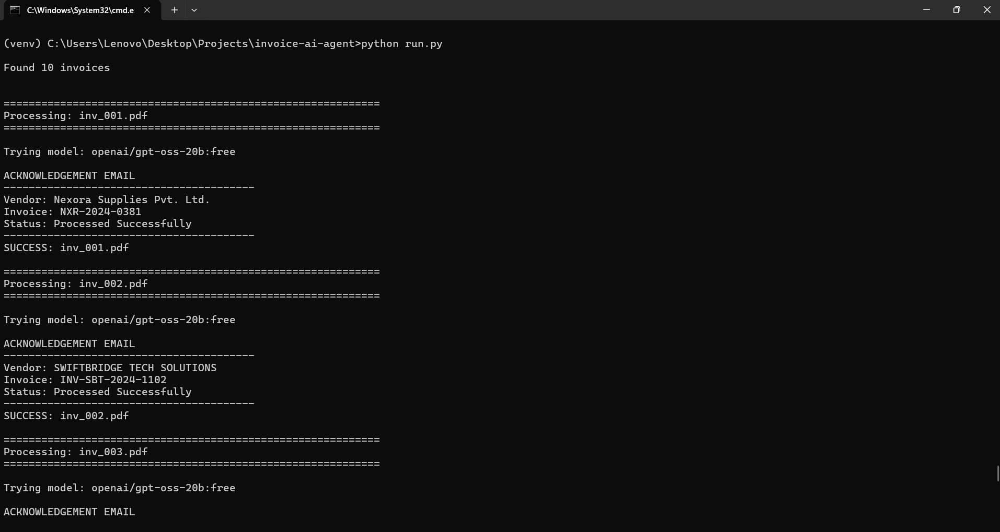
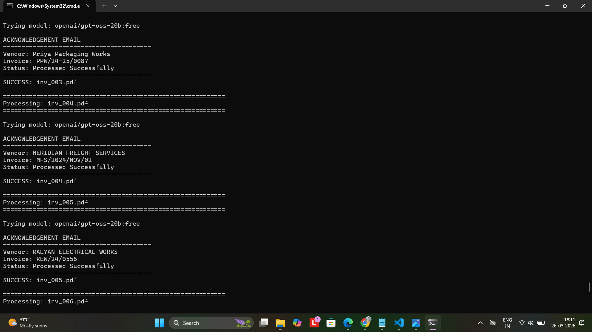
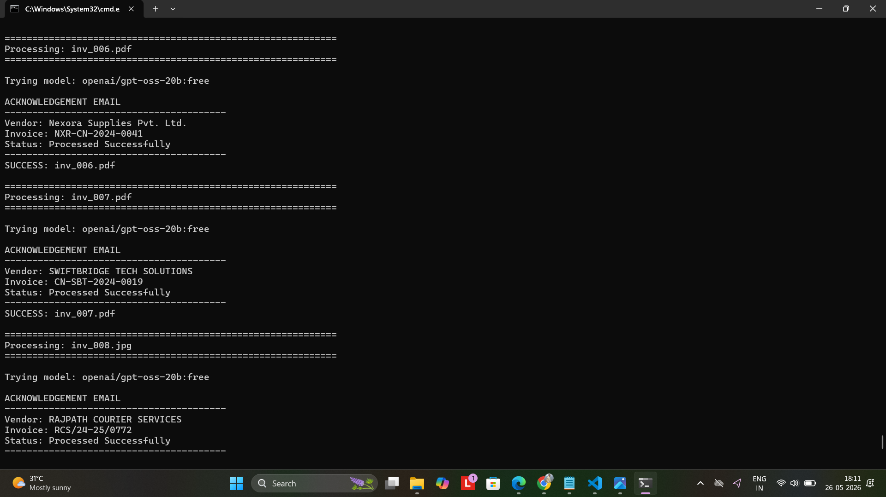
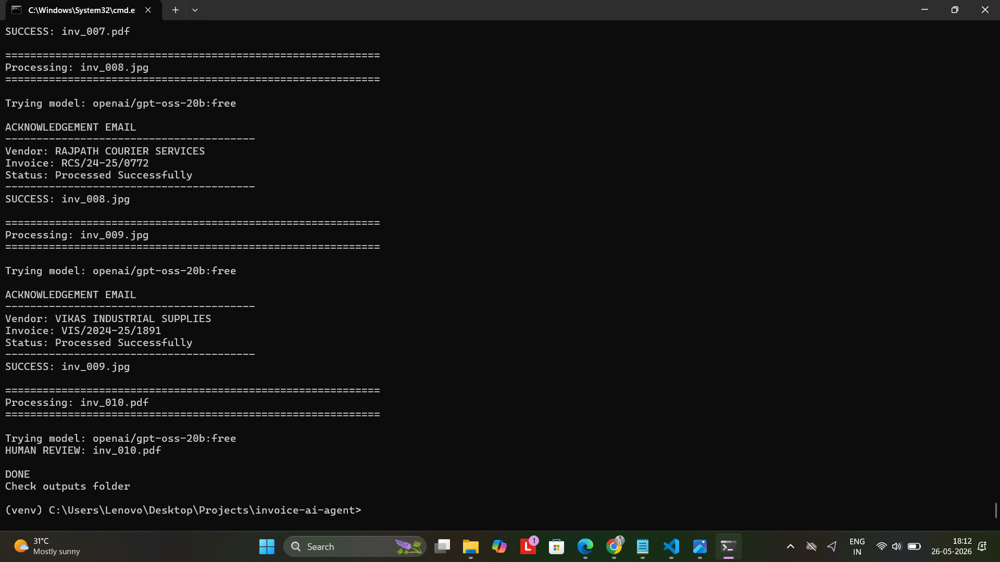
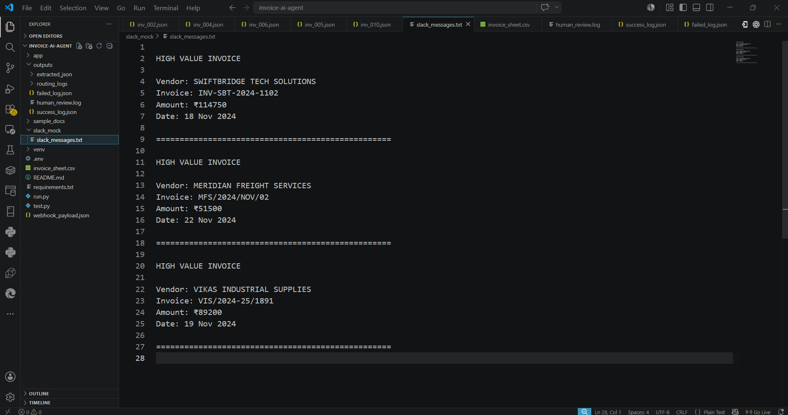
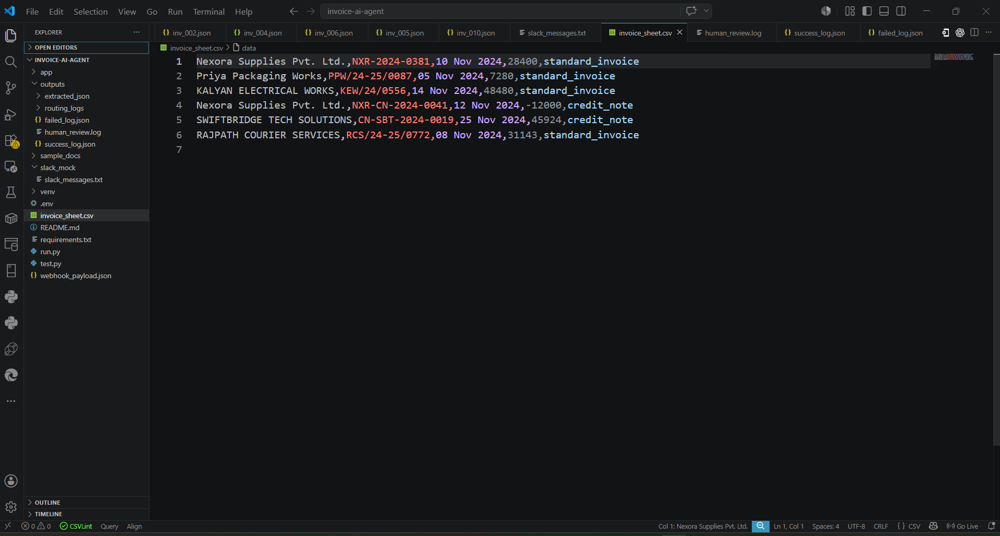
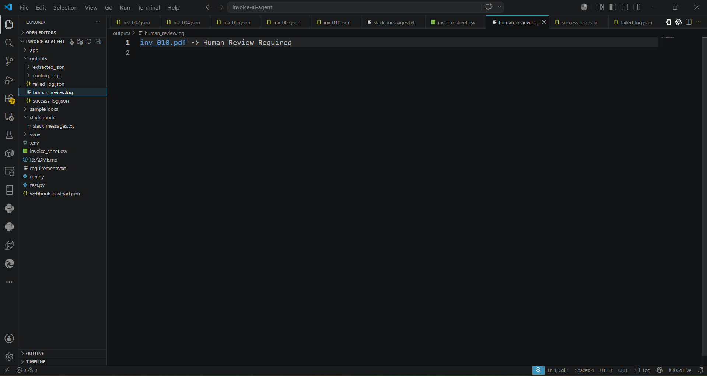
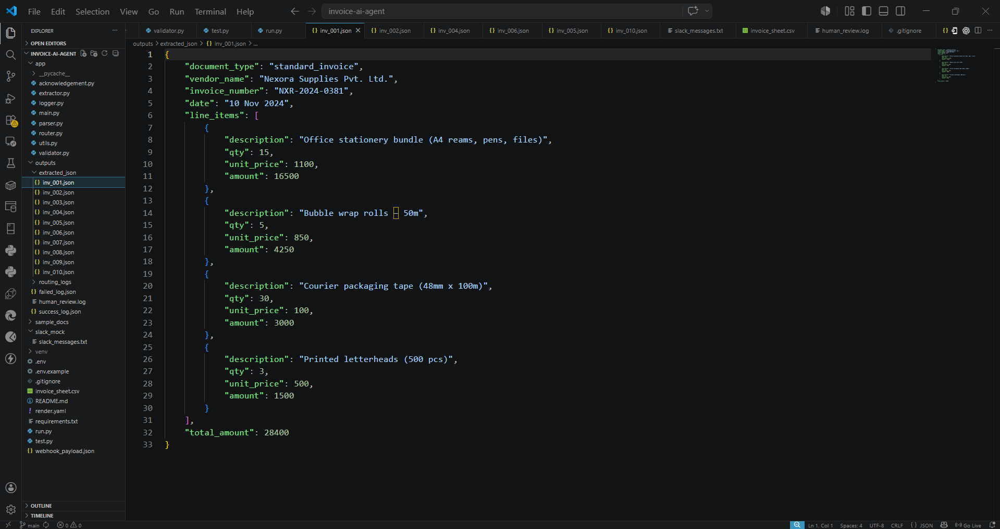

## AI Invoice Automation Agent

An end-to-end AI-powered invoice processing pipeline built for the **Dexler Energy Pvt Ltd – Junior AI Automation Engineer Take-Home Assignment**.

The system automatically ingests invoices, extracts structured data using OCR + LLMs, classifies documents, routes invoices based on business rules, and handles failures gracefully.

__________________________________________________________________________________________________________________________

## Features

- **PDF + Image Invoice Processing**
  - Supports PDF invoices
  - Supports scanned image invoices (`jpg`, `jpeg`, `png`) using OCR

- **AI-Powered Classification**
  - Classifies documents into:
    - `standard_invoice`
    - `credit_note`
    - `unknown`

- **Structured Data Extraction**
  Extracts:
  - Vendor Name
  - Invoice Number
  - Invoice Date
  - Line Items
  - Total Amount

- **Conditional Routing**
  - **Amount > ₹50,000 → Slack Route (Mock)**
  - **Amount ≤ ₹50,000 → CSV Logging**
  - **Unreadable/Unknown → Human Review**

- **Error Handling**
  - Retry logic for LLM failures
  - Graceful degradation with fallback providers
  - Human review logging for problematic invoices

- **Acknowledgement System**
  - Mock acknowledgement email logs after processing

__________________________________________________________________________________________________________________________

## Project Architecture

Incoming Invoice
        ↓
PDF Parser / OCR
        ↓
LLM Classification + Extraction
        ↓
JSON Validation
        ↓
Conditional Routing
   ├── Slack Route (>50k)
   ├── CSV Route (≤50k)
   └── Human Review (Unknown)
        ↓
Logging + Acknowledgement

__________________________________________________________________________________________________________________________

## Tech Stack

Python
FastAPI
PyMuPDF (PDF Parsing)
Tesseract OCR
OpenRouter LLM API
Pandas
Pydantic
Python Dotenv

__________________________________________________________________________________________________________________________

## Project Structure

invoice-ai-agent/
│── app/
│   ├── parser.py
│   ├── extractor.py
│   ├── validator.py
│   ├── router.py
│   ├── acknowledgement.py
│   ├── logger.py
│   └── main.py
│
│── sample_docs/
│── sample_output/
│── outputs/
│── slack_mock/
│
│── run.py
│── requirements.txt
│── .env.example
│── README.md

__________________________________________________________________________________________________________________________

Setup Instructions

1. Clone Repository
git clone https://github.com/harishgudagur/invoice-ai-automation-agent
cd invoice-ai-agent

2. Create Virtual Environment
python -m venv venv

Activate:
Windows:
venv\Scripts\activate

3. Install Dependencies
pip install -r requirements.txt

5. Configure Environment Variables

Create .env
OPENROUTER_API_KEY=your_api_key_here
TESSERACT_PATH=C:\Program Files\Tesseract-OCR\tesseract.exe

_________________________________________________________________________________________________________________________________________________________

## Running the Pipeline

Run:
python run.py
terminal_run1.png
terminal_run2.png
terminal_run3.png
terminal_run4.png

# The pipeline will:

Parse all invoices from sample_docs/
Extract invoice details
Classify invoice type
Route invoices
Generate logs and outputs

__________________________________________________________________________________________________________________________________________________________________________________

## Routing Logic

Slack Route (Mock)

If:

Total Amount > ₹50,000

Invoice routed to:

slack_mock/slack_messages.txt

_______________________________________________________________________________________________________________________________________

## CSV Route

If:

Total Amount ≤ ₹50,000

Invoice stored in:

invoice_sheet.csv

______________________________________________________________________________________________________________________________________

## Human Review

If document is:

unreadable
malformed
unknown classification

Logged to:

outputs/human_review.log

________________________________________________________________________________________________________________________________________________________

Extracted JSON

Open:

sample_output/extracted_json/inv_001.json

________________________________________________________________________________________________________________________________________________________

## Design Decisions

Ambiguous Total Handling (inv_005)

One invoice contained multiple totals (subtotal vs final payable amount).

Decision:

Used Final Payable / Net Payable amount instead of subtotal for routing because it better represents the actual financial obligation.

_________________________________________________________________________________________________________________________________________________________

## Graceful Degradation

Implemented:

Retry mechanism
Fallback LLM providers
Structured failure logging

This ensures invoices are never silently dropped.

_________________________________________________________________________________________________________________________________________________________

## Screenshots

### Pipeline Execution

---

### Slack Routing (High Value Invoice)

---

### CSV Logging

---

### Human Review Handling

---

### Extracted JSON Output

__________________________________________________________________________________________________________________________
